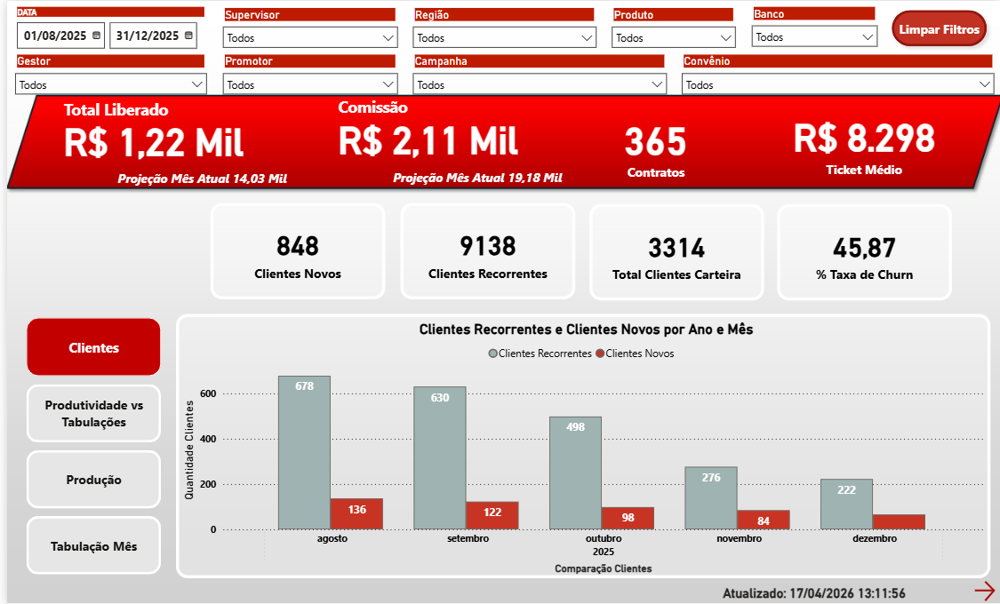

# 🎯 Engine de Growth Analytics, Atribuição de Funil & Automação Comercial


Solução analítica de **Growth & Marketing Analytics** orquestrada por **Apache Airflow**, projetada para realizar atribuição multi-canal de leads, cálculo de Cohortes de retenção, mensuração de Unit Economics (LTV, CAC, ROI) e automação de réguas operacionais de vendas.

---

## 📊 Dashboard de Performance & Growth (Power BI)

Abaixo está o dashboard estratégico alimentado diretamente pelas modelagens e pipelines contidos nesta pasta:



### 🔍 O que este Dashboard demonstra e como se conecta ao Código:
- **Volume de Leads & Investimento:** Cruzamento de dados de custos de tráfego pago (Meta/Google Ads/Whatsapp Cloud API) ingeridos via API e estruturados no Data Warehouse.
- **Funil de Vendas de Ponta a Ponta (Leads ➔ MQL ➔ SQL ➔ Vendas):** Mapeado via eventos customizados implementados no **GTM** e consolidados no banco de dados analítico através do script [`growth_engine.py`](./python_file/growth_engine.py).
- **Eficiência Financeira (CPA, CPC, ROI e ROAS):** Calculados a partir de relacionamentos dimensionais complexos usando SQL, permitindo saber o custo real por lead qualificado.
- **Detecção de Reincidência de Tráfego:** Baseado no script [`leads_reincidentes_30_dias.sql`](./sql/leads_reincidentes_30_dias.sql), que ajuda a identificar leads que reentraram no funil em 30 dias para entender melhor o público.

---

## 🎯 Problema de Negócio

Empresas que gerenciam múltiplos canais de aquisição de clientes sofrem com a "cegueira de atribuição" (não saber qual anúncio ou campanha gera faturamento real e não apenas cliques). Além disso, a demora na distribuição de leads para o time comercial reduzia drasticamente as taxas de conversão de funil.

---

## ⚡ Solução Desenvolvida

Implementação de um ecossistema analítico e operacional orquestrado pelo Airflow (**DAG `growth_analytics_pipeline`**), que realiza a extração, tratamento estatístico de métricas de aquisição e dispara gatilhos de automação comercial de resposta rápida.

### 🌟 Destaques & Funcionalidades
- **⚙️ Orquestração Automatizada:** Fluxo agendado que executa o processamento de leads, calcula tabelas de cohortes e aciona automações sequencialmente.
- **🎯 Atribuição Multi-Canal e Tracking:** Parametrização robusta de UTMs via Google Tag Manager e GA4, rastreando a jornada de origem do lead até a conversão final no CRM.
- **📊 Cálculo de Cohortes & Retenção:** Execução do script [`cohort_analysis.py`](./python_file/cohort_analysis.py) que agrupa clientes por mês de aquisição (safra) e acompanha a taxa de retenção e receita recorrente em janelas de 12 e 24 meses. A lógica SQL está descrita em [`cohort_retencao_clientes.sql`](./sql/cohort_retencao_clientes.sql) e [`safra_clientes.sql`](./sql/safra_clientes.sql).
- **⚡ Automação de Lead Response via n8n & WhatsApp:** Servidor API customizado em [`api_server.py`](./python_file/api_server.py) atuando como webhook para apoiar nos processos de Growth.

---

## 🏗️ Workflow da DAG no Apache Airflow

```
┌───────────────────────────────────────────────────────────────────┐
│               DAG Airflow (`growth_analytics_pipeline`)           │
└─────────────────────────────────┬─────────────────────────────────┘
                                  │
 ┌────────────────────────────────▼────────────────────────────────┐
 | Task 1: processar_arquivos_leads                                |
 | (Ingestão de leads, veículos de mídia e regras comerciais)      |
 └────────────────────────────────┬────────────────────────────────┘
                                  │
 ┌────────────────────────────────▼────────────────────────────────┐
 | Task 2: calcular_cohorts_retencao                               |
 | (Cálculo estatístico de safras em Python & SQL dimensionais)    |
 └────────────────────────────────┬────────────────────────────────┘
                                  │
 ┌────────────────────────────────▼────────────────────────────────┐
 | Task 3: notificar_webhooks_n8n                                  |
 | (Gatilho para envio imediato de leads aos corretores pelo n8n)  |
 └─────────────────────────────────────────────────────────────────┘
```

---

## 🛠️ Stack de Tecnologias

- **Orquestração:** Apache Airflow 2.x (DAGs, PythonOperator)
- **Web Analytics & Rastreamento:** GA4 (Google Analytics 4), GTM (Google Tag Manager)
- **Growth & Marketing Automation:** n8n, WhatsApp Cloud API, REST Webhooks
- **Analytics Engineering / Modelagem:** SQL (CTEs, Window Functions), Python (Pandas, Numpy)
- **Visualização de Dados:** Power BI, Metabase, Looker

---

## 📊 Impacto / Resultados / Métricas Alcançadas

- 🎯 **Relação LTV/CAC > 7x:** Através da análise de safras, identificou-se que clientes de canais específicos apresentavam LTV médio de **~R$ 1.200** para um CAC médio controlado de **~R$ 170**, permitindo a realocação eficiente de orçamento.
- ⚡ **Redução de 80% no Tempo de Resposta:** Distribuição automatizada de leads via webhook em menos de **10 minutos** (anteriormente levava até 50 minutos em processos manuais).
- 📈 **Decisão Orientada por Margem:** Substituição da métrica de vaidade de "volume de leads" por "ROAS e Lucro por Campanha".

---

> 🔒 **Nota de Segurança e Privacidade:** Os datasets, relatórios, códigos e consultas SQL apresentados utilizam dados sintéticos e mockados para demonstração das metodologias analíticas.
