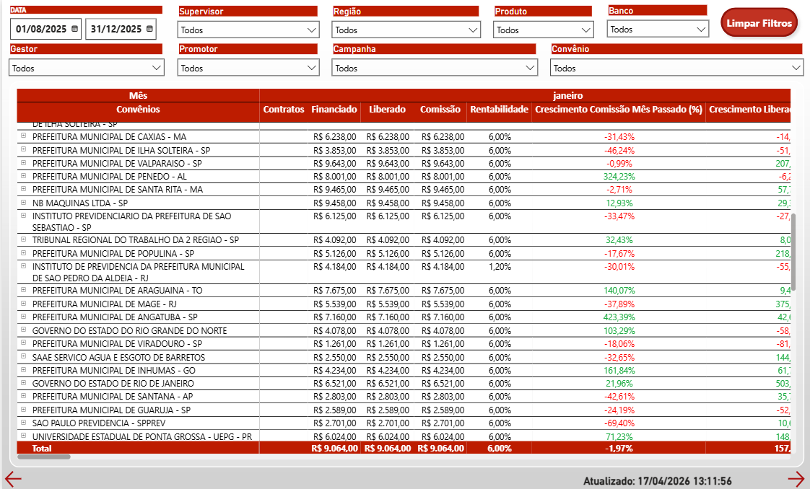
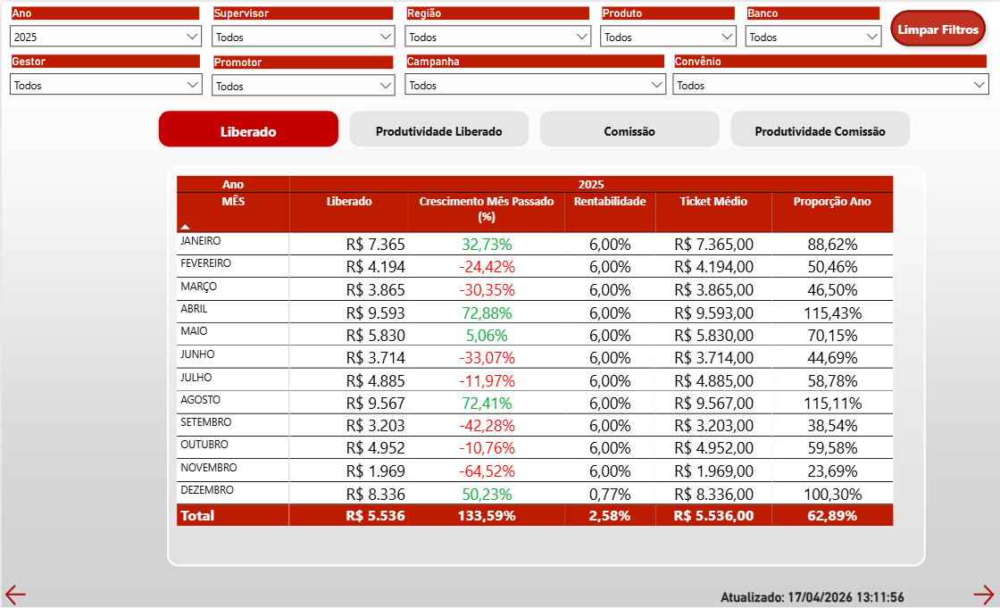

# 🔄 Pipeline ETL Automatizado & Reconciliação Financeira de Comissões


Pipeline de Engenharia e Reconciliação de Dados Financeiros orquestrado por **Apache Airflow (DAGs)**, projetado para extrair, sanitizar e cruzar de forma automatizada repasses de comissões multibancos a partir de fontes altamente heterogêneas.

---

## 📊 Dashboards de Reconciliação Financeira (Power BI)

Abaixo estão os relatórios interativos gerados a partir do processamento do motor de conciliação desta pasta:

### 1. Detalhamento de Resultados por Convênio
Este painel apresenta a divisão das vendas e rentabilidade segmentados por convênio, facilitando a identificação de quais trazem maior margem e oportunidades.


### 2. Análise de Evolução Mês a Mês
Uma visão histórica de consolidação de vendas, ticket médio de propostas faturadas para acompanhar tendência de crescimento.


### ⚙️ Conexão dos Dashboards com os Arquivos de Código:
- **Sanitização de Contratos e Taxas:** O script [`gerar_tabela_taxas.py`](./python_file/gerar_tabela_taxas.py) higieniza tabelas de coeficientes de taxas de repasse contratuais para validar se as tabelas originais foram aplicadas corretamente.
- **Motor de Reconciliação Cruzada (Reconciliation Engine):** O arquivo [`relatorios_comissao.py`](./python_file/relatorios_comissao.py) executa o cruzamento (joins complexos em Pandas) comparando o valor de comissão provisionado no CRM/ERP com o valor real depositado no extrato do parceiro, apontando discrepâncias centavo por centavo.
- **Estruturação de Status de Faturamento:** A regra contábil em SQL [`seguro_pgto.sql`](./sql/seguro_pgto.sql) faz a classificação de status de pagamento (Pendente, Pago Parcial, Pago Total, Divergente).
- **Consultas em SQL:** Outras consultas estão diretamente ligadas no PowerBI.
---

## 🎯 Problema de Negócio

No mercado financeiro e de correspondentes bancários, as comissões pagas por propostas fechadas variam conforme coeficientes dinâmicos (tabelas de comissionamento de cada banco). 

A consolidação manual de extratos de PDF/Excel enviados pelas instituições contra os registros locais gerava:
- **Vulnerabilidade a Perdas Financeiras:** Comissões pagas a menor passavam desapercebidas por falta de cruzamento individual de propostas.
- **Alto Custo Operacional:** Analistas gastando mais de 5 horas por dia executando PROCVs manuais lentos no Excel.
- **Dados Obsoletos:** Atraso de dias para atualizar relatórios de faturamento corporativo.

---

## ⚡ Solução Desenvolvida

Desenvolvimento de um pipeline de ETL robusto e centralizado no **Apache Airflow (DAG `etl_comissoes`)**. O pipeline extrai dados operacionais, lê planilhas e extratos de repasse dos bancos, higieniza os dados e aplica o algoritmo de conciliação cruzada.

### 🌟 Destaques & Funcionalidades
- **⚙️ Orquestração e Tolerância a Falhas:** DAGs programadas para rodar diariamente com tratamento de retries e alertas em caso de inconsistência de formato nos extratos.
- **🧼 Higienização Massiva com Python/Pandas:** Remoção de ruídos em nomes, normalização de CNPJ/CPF, tratamento de nulos e conversão de strings numéricas e datas heterogêneas em formato padrão.
- **📅 Regras de Negócio e Feriados:** Integração com calendários comerciais para cálculo de D+X úteis de pagamento baseando-se em tabelas do script [`comissao.py`](./python_file/comissao.py).
- **📈 Modelagem Star Schema para BI:** Exportação de tabelas de Fato (Fato Repasses, Fato Propostas) e Dimensões (Dim Convênios, Dim Bancos, Dim Tempo) prontas para Power BI.

---

## 🏗️ Arquitetura do Pipeline no Apache Airflow

```
 ┌───────────────────────────────────────────────────────────────────┐
 │                   DAG Apache Airflow (`etl_comissoes`)            │
 └─────────────────────────────────┬─────────────────────────────────┘
                                   │
  ┌────────────────────────────────▼────────────────────────────────┐
  │  Task 1: extrair_dados_multi_fonte                              │
  │  (Leitura de bases locais SQLite/MySQL e extratos dos bancos)   │
  └────────────────────────────────┬────────────────────────────────┘
                                   │
  ┌────────────────────────────────▼────────────────────────────────┐
  │  Task 2: reconciliar_e_sanitizar_comissoes                      │
  │  (Execução do engine Pandas de cruzamento e cálculo de taxas)   │
  └────────────────────────────────┬────────────────────────────────┘
                                   │
  ┌────────────────────────────────▼────────────────────────────────┐
  │  Task 3: exportar_tabelas_powerbi                               │
  │  (Exportação das tabelas dimensionais limpas para o DW / BI)   │
  └─────────────────────────────────────────────────────────────────┘
```

---

## 🛠️ Tecnologias Utilizadas

- **Orquestrador:** Apache Airflow 2.x (DAGs, PythonOperator)
- **Engine ETL:** Python 3.x (Pandas, NumPy, OpenPyXL, Holidays)
- **Data Warehousing & SQL:** MySQL, PostgreSQL
- **Modelagem & BI:** Power BI (DAX, Power Query, Star Schema)

---

## 📈 Resultados De Impacto

- ⏱️ **-97% no Tempo de Processamento:** Auditoria financeira consolidada reduzida de **5 horas para apenas 10 minutos**.
- ⌛ **100+ Horas Mensais Salvas:** Eliminação completa do trabalho operacional de cruzamento de planilhas.
- 🎯 **100% de Acurácia:** Garantia de identificação imediata de repasses a menor ou propostas pagas sem faturamento.

---

> 🔒 **Nota de Segurança e Privacidade:** Dados sensíveis de clientes, contratos e chaves de acesso foram completamente anonimizados e mockados para este portfólio.
